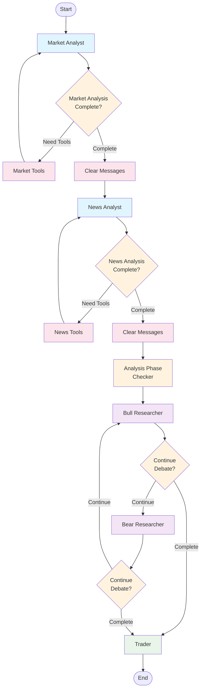

# 🔍 LLM Stock Team Analyzer

[](https://www.python.org/downloads/)
[](https://opensource.org/licenses/MIT)
[](https://python.langchain.com/docs/langgraph)

A modernized, local AI multi-agent stock analysis framework designed to provide comprehensive investment decision support. This system uses multiple specialized AI agents working collaboratively to perform technical analysis, news sentiment analysis, multi-perspective investment debate, and generate synthesized investment recommendations.

## ✨ Core Features

### 🤖 Multi-Agent Collaborative Architecture

- **Market Analyst** - Intelligent technical analysis with context-aware indicator selection
- **News Analyst** - Google News sentiment analysis and event impact assessment
- **Bull Researcher** - Optimistic investment perspectives and growth potential analysis
- **Bear Researcher** - Risk-oriented analysis and conservative investment viewpoints
- **Trader** - Final decision synthesis and comprehensive trading recommendations

### 📊 Intelligent Technical Analysis

- **Automated Indicator Combination**: Intelligently selects 2-3 complementary technical indicators based on market conditions
- **Optimized Parameter Configuration**: Uses the most suitable indicator parameters for different market scenarios
- **Four Strategic Analysis Approaches**:
  - 📈 **Trend Following**: 20/10/5MA + MACD(5,13,9) + ADX
  - 💥 **Volatility Breakout**: Boll(10,1.5) + KDJ(5) + ATR(10)
  - 🔁 **Reversal Detection**: RSI(7) + OBV + MACD divergence analysis
  - ⚖️ **Risk Assessment**: ATR(10) + Boll(20,2) + RSI(7)

### 🎯 System Optimization Features

- **Streamlined Logging**: Focused on critical state transitions and character count tracking
- **State Flow Monitoring**: Complete analysis workflow state tracking
- **Time Consistency**: Ensures accurate temporal descriptions across all analysis reports
- **Local Deployment**: Fully local operation ensuring data security

## 🏗️ LangGraph Workflow Architecture

The system uses LangGraph to orchestrate a sophisticated multi-agent workflow:



### Workflow Description

1. **Analysis Phase**: Market and News analysts sequentially perform their specialized analysis
2. **Tool Integration**: Each analyst can call external tools (Yahoo Finance, Google News) as needed
3. **Message Management**: Automatic message clearing between phases to maintain context clarity
4. **Debate Phase**: Bull and Bear researchers engage in structured investment perspective debate
5. **Final Synthesis**: Trader agent synthesizes all findings into actionable investment recommendations

## 🚀 Quick Start

### Requirements

- Python 3.12+
- Azure OpenAI API access
- Network connection (for Yahoo Finance and Google News data)

### Installation

1. **Clone the repository**

   ```bash
   git clone https://github.com/yourusername/llm-stock-team-analyzer.git
   cd llm-stock-team-analyzer
   ```

2. **Install dependencies**

   ```bash
   # Using uv (recommended)
   uv sync
   ```

3. **Configure settings**

   ```bash
   # Copy configuration template
   cp llm_stock_team_analyzer/configs/config.example.yaml llm_stock_team_analyzer/configs/config.yaml
   
   # Edit configuration file with your Azure OpenAI credentials
   nano llm_stock_team_analyzer/configs/config.yaml
   ```

4. **Run analysis**

   ```bash
   # Using uv
   uv run python main.py
   ```

### Configuration

Edit `llm_stock_team_analyzer/configs/config.yaml`:

```yaml
azure_openai:
  endpoint: "https://your-resource.openai.azure.com/"
  api_version: "2024-02-15-preview"
  deployment: "your-deployment-name"
  subscription_key: "your-api-key"

llm:
  temperature: 0.5
  max_tokens: 4096
  retry: 3
  max_debate_rounds: 1
  request_timeout: 60

rate_limiting:
  enabled: true
  requests_per_minute: 10
  tokens_per_minute: 40000
  delay_between_requests: 6
```

## 🏗️ System Architecture

### Core Component Structure

```
llm_stock_team_analyzer/
├── agents/                    # AI Agent Modules
│   ├── analysts/             # Analyst Agents
│   │   ├── market_analyst.py # Technical Analyst
│   │   └── news_analyst.py   # News Analyst
│   ├── researchers/          # Research Agents
│   │   ├── bull_researcher.py # Bull Researcher
│   │   └── bear_researcher.py # Bear Researcher
│   ├── trader/              # Trading Agent
│   │   └── trader.py        # Final Decision Synthesis
│   └── utils/               # Agent Utilities
├── dataflows/               # Data Flow Processing
│   ├── interface.py         # Data Interface
│   ├── indicators.py        # Technical Indicator Calculations
│   ├── yfinance_utils/      # Yahoo Finance Tools
│   └── googlenews_utils/    # Google News Tools
├── graph/                   # Workflow Graph
│   ├── trading_graph.py     # Main Trading Graph
│   ├── conditional_logic.py # Conditional Logic
│   └── signal_processing.py # Signal Processing
└── configs/                 # Configuration Management
```

### Workflow Process

1. **Data Collection Phase**
   - Yahoo Finance stock price and technical indicator data
   - Google News related news and sentiment data

2. **Agent Analysis Phase**
   - Market Analyst performs multi-indicator technical analysis
   - News Analyst executes news sentiment and event analysis

3. **Debate Research Phase**
   - Bull/Bear Researchers engage in multi-perspective investment viewpoint debate
   - Deep exploration of investment logic through structured debate

4. **Decision Synthesis Phase**
   - Trader synthesizes all analysis results
   - Generates final investment recommendations and risk assessments

## 📈 Technical Indicator System

### Supported Indicators

| Indicator Type | Indicator Name | Parameter Config | Usage Description |
|---------------|---------------|------------------|-------------------|
| **Trend** | MA Series | 5/10/20/50 periods | Multi-level trend confirmation |
| **Momentum** | MACD | (5,13,9) / (12,26,9) | Fast/Standard momentum analysis |
| **Oscillator** | RSI | 7/14 periods | Overbought/oversold & reversal signals |
| **Channel** | Bollinger Bands | (10,1.5) / (20,2) | Volatility breakout & risk channels |
| **Stochastic** | KDJ | 5/9 periods | Short-term reversal & entry/exit timing |
| **Volatility** | ATR | 10/14 periods | Dynamic stop-loss & risk control |
| **Volume** | OBV | - | Volume-price divergence & trend confirmation |
| **Trend Strength** | ADX | 14 periods | Trend strength assessment |

### Intelligent Combination Strategies

The system automatically selects the most suitable indicator combinations based on the following logic:

- **Clear Trending Market** → Trend Following (MA Series + MACD + ADX)
- **Consolidation Awaiting Breakout** → Volatility Breakout (Bollinger + KDJ + ATR)
- **Seeking Reversal Points** → Reversal Detection (RSI + OBV + MACD Divergence)
- **High Volatility Environment** → Risk Assessment (ATR + Bollinger + RSI)

## 💡 Usage Examples

### Basic Stock Analysis

```bash
# Start the program
python main.py

# Enter stock ticker symbol (e.g., AAPL, TSLA, NVDA, 2330.TW)
Enter stock ticker symbol [AAPL]: TSLA

# Enter analysis date
Enter analysis date [2025-07-10]: 2025-07-10

# System will automatically execute complete analysis workflow
```

### Analysis Report Example

After analysis completion, the system generates a comprehensive report containing:

1. **Technical Analysis Report**
   - Multi-indicator comprehensive analysis
   - Support and resistance levels
   - Trend direction assessment

2. **News Sentiment Analysis**
   - Related news summary
   - Sentiment score evaluation
   - Market impact analysis

3. **Investment Perspective Debate**
   - Bull arguments and rationale
   - Bear risks and considerations
   - In-depth analysis of controversial points

4. **Final Investment Recommendations**
   - Comprehensive investment rating
   - Specific operational suggestions
   - Risk control strategies

## 🛠️ Development Guide

### Development Environment Setup

```bash
# Install development dependencies
uv sync --group dev

# Code formatting
make format

# Code checking
make lint
make check

# Run tests
make unit-test
```

### Custom Agents

You can create custom analysis agents by inheriting from base agent classes:

```python
def create_custom_analyst(llm, toolkit):
    def custom_analyst_node(state):
        # Custom analysis logic
        pass
    return custom_analyst_node
```

### Adding Technical Indicators

Add indicator calculation functions in `llm_stock_team_analyzer/dataflows/indicators.py`:

```python
def calculate_custom_indicator(df, period=14):
    """Custom technical indicator calculation"""
    # Indicator calculation logic
    return result
```

### Software Requirements

- Python 3.12+
- Azure OpenAI API service
- Supported OS: Windows, macOS, Linux

### API Limitations

- Azure OpenAI API rate limiting
- Yahoo Finance data fetching limits
- Google News query frequency limits

## 🤝 Contributing

We welcome community contributions!

### Code Standards

- Use Ruff for code formatting and checking
- Follow PEP 8 Python style guidelines
- Add appropriate tests for new features
- Update relevant documentation

## 📜 License

This project is licensed under the MIT License - see the [LICENSE](LICENSE) file for details.

## 🗺️ Roadmap

### Short-term Plans

- [ ] Add more technical indicator support
- [ ] Implement automatic indicator combination optimization algorithms
- [ ] Enhance risk management modules
- [ ] Multi-language interface support

### Long-term Vision

- [ ] Cryptocurrency analysis support
- [ ] Machine learning prediction modules
- [ ] Real-time data stream processing
- [ ] Portfolio optimization recommendations

## 📊 Disclaimer

**Important Notice**: All analysis reports and investment recommendations generated by this system are for reference only and do not constitute professional investment advice. Investing involves risks, so please proceed with caution. Users should:

- Conduct independent research and analysis
- Consider personal risk tolerance
- Consult professional financial advisors when necessary
- Take full responsibility for their investment decisions

The technical analysis and market predictions provided by the system do not guarantee accuracy, and past performance does not represent future results.

---

**⭐ If this project helps you, please give us a Star!**

</div>
