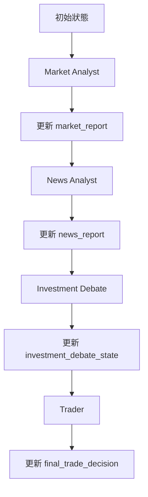
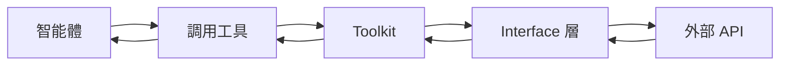
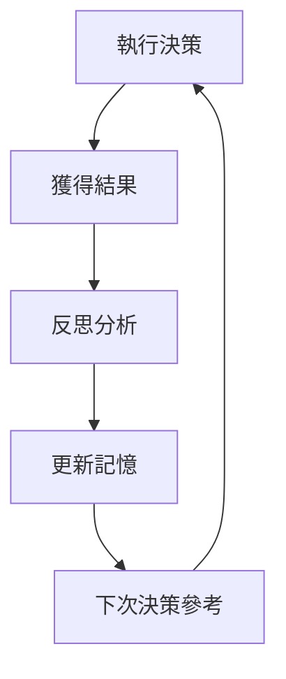

# Agent Utils 深度解析文檔

## 📋 概述

`/agents/utils` 資料夾包含了整個多智能體系統的核心基礎設施，負責定義狀態結構、提供工具接口和管理智能體記憶。這些組件是系統運作的基石，確保智能體之間能夠有效協作和學習。

## 🏗️ 整體架構

```
agents/utils/
├── agent_states.py   # 定義智能體狀態結構和數據流
├── agent_utils.py    # 提供工具接口和實用功能
└── memory.py         # 管理智能體記憶和學習機制
```

## 🔄 核心組件詳解

### 1. AgentStates (`agent_states.py`)

這個文件定義了整個系統的**狀態結構**，是所有智能體之間數據交換的基礎。

#### 🎯 主要數據結構

**InvestDebateState - 投資辯論狀態**

```python
class InvestDebateState(TypedDict):
    bull_history: Annotated[str, "Bullish Conversation history"]      # 多頭對話歷史
    bear_history: Annotated[str, "Bearish Conversation history"]      # 空頭對話歷史
    history: Annotated[str, "Conversation history"]                   # 總對話歷史
    current_response: Annotated[str, "Latest response"]               # 最新回應
    judge_decision: Annotated[str, "Final judge decision"]            # 最終判決
    count: Annotated[int, "Length of the current conversation"]       # 對話長度
```

**設計亮點**：
- **分離式歷史記錄**：多頭和空頭的觀點分別記錄，避免混淆
- **對話追蹤**：完整記錄辯論過程，支持回溯分析
- **狀態計數**：防止無限循環，控制辯論輪數

**AgentState - 主要智能體狀態**

```python
class AgentState(MessagesState):
    # 基本信息
    company_of_interest: Annotated[str, "Company that we are interested in trading"]
    trade_date: Annotated[str, "What date we are trading at"]
    sender: Annotated[str, "Agent that sent this message"]
    
    # 分析階段狀態
    market_report: Annotated[str, "Report from the Market Analyst"]
    news_report: Annotated[str, "Report from the News Researcher of current world affairs"]
    
    # 辯論階段狀態
    investment_debate_state: Annotated[InvestDebateState, "Current state of the debate on if to invest or not"]
    investment_plan: Annotated[str, "Plan generated by the Analyst"]
    
    # 交易階段狀態
    trader_investment_plan: Annotated[str, "Plan generated by the Trader"]
    final_trade_decision: Annotated[str, "Final decision made by the Trader"]
```

#### 💡 狀態流轉設計

**階段性狀態管理**：
1. **初始階段** → `company_of_interest`, `trade_date`
2. **分析階段** → `market_report`, `news_report`
3. **辯論階段** → `investment_debate_state`, `investment_plan`
4. **決策階段** → `trader_investment_plan`, `final_trade_decision`

**繼承 MessagesState**：
- 繼承自 LangGraph 的 `MessagesState`，自動管理訊息列表
- 支持 LangGraph 的狀態更新和合併機制
- 確保與 LangGraph 框架的完全兼容

#### 🔍 類型註解的重要性

```python
market_report: Annotated[str, "Report from the Market Analyst"]
```

- **類型安全**：確保數據類型正確
- **文檔化**：Annotated 提供清晰的字段說明
- **IDE 支持**：提供更好的代碼提示和錯誤檢查
- **運行時驗證**：支持運行時類型檢查

### 2. AgentUtils (`agent_utils.py`)

提供**工具接口和實用功能**，是智能體與外部資源互動的橋樑。

#### 🛠️ 核心工具類 - Toolkit

**配置管理機制**：
```python
class Toolkit:
    _config = None
    
    @classmethod
    def update_config(cls, config):
        """更新類級別配置"""
        cls._config = config
    
    def __init__(self, config=None):
        if config:
            self.update_config(config)
        elif self._config is None:
            self._config = get_config()
```

**設計特點**：
- **單例模式配置**：使用類變量確保配置一致性
- **靈活初始化**：支持運行時配置覆蓋
- **懶加載**：配置僅在需要時載入

#### 🔧 核心工具函數

**1. Yahoo Finance 數據獲取**

```python
@staticmethod
@tool
def get_YFin_data(
    symbol: Annotated[str, "ticker symbol of the company"],
    start_date: Annotated[str, "Start date in yyyy-mm-dd format"],
    end_date: Annotated[str, "End date in yyyy-mm-dd format"],
) -> str:
    """
    從 Yahoo Finance 獲取股價數據
    """
    result_data = interface.get_stock_price_data(symbol, start_date, end_date)
    return result_data
```

**2. 技術指標分析**

```python
@staticmethod
@tool
def get_stockstats_indicators_report(
    symbol: Annotated[str, "ticker symbol of the company"],
    indicator: Annotated[str, "technical indicator to get the analysis and report of"],
    curr_date: Annotated[str, "The current trading date you are trading on, YYYY-mm-dd"],
    look_back_days: Annotated[int, "how many days to look back"] = 30,
) -> str:
    """
    獲取技術指標分析報告
    重要：每次調用只接受一個指標
    """
    result_stockstats = interface.get_stock_stats_indicators_window(
        symbol, indicator, curr_date, look_back_days, True
    )
    return result_stockstats
```

**3. 公司基本信息**

```python
@staticmethod
@tool
def get_company_info(
    symbol: Annotated[str, "ticker symbol of the company"],
) -> str:
    """
    獲取公司基本信息
    用於確保新聞搜索使用正確的公司名稱
    """
    try:
        stock_info = interface.get_company_info(symbol)
        return stock_info
    except Exception as e:
        return f"Error retrieving company info for {symbol}: {str(e)}"
```

**4. Google 新聞搜索**

```python
@staticmethod
@tool
def get_google_news(
    query: Annotated[str, "Query to search with"],
    curr_date: Annotated[str, "Curr date in yyyy-mm-dd format"],
):
    """
    從 Google News 獲取最新新聞
    """
    google_news_results = interface.get_google_news(query, curr_date, 7)
    return google_news_results
```

#### 💡 工具設計原則

**裝飾器模式**：
- 使用 `@tool` 裝飾器將函數轉換為 LangChain 工具
- 自動處理參數驗證和錯誤處理
- 支持 LangGraph 的工具調用機制

**類型注解驅動**：
- 使用 `Annotated` 提供詳細的參數說明
- LangChain 自動根據注解生成工具描述
- 提供更好的 AI 智能體理解

**錯誤處理**：
```python
try:
    stock_info = interface.get_company_info(symbol)
    return stock_info
except Exception as e:
    return f"Error retrieving company info for {symbol}: {str(e)}"
```

**訊息清理機制**：
```python
def create_msg_delete():
    def delete_messages(state):
        """清理訊息並添加 Anthropic 兼容的佔位符"""
        messages = state["messages"]
        
        # 移除所有訊息
        removal_operations = [RemoveMessage(id=m.id) for m in messages]
        
        # 添加最小佔位符訊息
        placeholder = HumanMessage(content="Continue")
        
        return {"messages": removal_operations + [placeholder]}
    
    return delete_messages
```

**設計目的**：
- **防止上下文溢出**：定期清理累積的訊息
- **保持性能**：避免過長的對話歷史影響推理
- **框架兼容**：支持 Anthropic 等不同 LLM 提供商

### 3. Memory (`memory.py`)

實現**智能體記憶和學習機制**，使系統能夠從過往經驗中學習。

#### 🧠 核心記憶類 - FinancialSituationMemory

**初始化和配置**：
```python
def __init__(self, name, config):
    # 使用本地 HuggingFace 嵌入模型（離線運行）
    self.embedding_model = HuggingFaceEmbeddings(
        model_name="all-MiniLM-L6-v2",           # 輕量級但高效的嵌入模型
        model_kwargs={"device": "cpu"},          # CPU 運行，確保兼容性
        encode_kwargs={"normalize_embeddings": True},  # 正規化嵌入向量
    )
    
    # 建立 ChromaDB 客戶端
    self.chroma_client = chromadb.Client(Settings(allow_reset=True))
    self.situation_collection = self.chroma_client.create_collection(name=name)
```

**技術選型說明**：
- **all-MiniLM-L6-v2**：平衡了性能和資源消耗的嵌入模型
- **CPU 運行**：確保在各種環境下都能穩定運行
- **ChromaDB**：高效的向量數據庫，支持相似度搜索
- **正規化嵌入**：提高向量比較的準確性

#### 🔍 嵌入向量生成

```python
def get_embedding(self, text):
    """使用 HuggingFace 嵌入模型獲取文本的嵌入向量"""
    return self.embedding_model.embed_query(text)
```

**工作原理**：
1. 將文本轉換為數值向量
2. 向量捕捉文本的語義信息
3. 支持語義相似度比較

#### 💾 記憶存儲機制

```python
def add_situations(self, situations_and_advice):
    """添加金融情況和對應建議。參數是元組列表 (situation, recommendation)"""
    
    situations = []
    advice = []
    ids = []
    embeddings = []
    
    offset = self.situation_collection.count()  # 獲取當前記錄數量
    
    for i, (situation, recommendation) in enumerate(situations_and_advice):
        situations.append(situation)
        advice.append(recommendation)
        ids.append(str(offset + i))                    # 確保唯一 ID
        embeddings.append(self.get_embedding(situation))  # 預計算嵌入向量
    
    # 批量插入到向量數據庫
    self.situation_collection.add(
        documents=situations,                           # 原始文本
        metadatas=[{"recommendation": rec} for rec in advice],  # 關聯建議
        embeddings=embeddings,                          # 嵌入向量
        ids=ids,                                       # 唯一標識符
    )
```

**存儲策略**：
- **批量處理**：提高寫入效率
- **預計算嵌入**：避免查詢時重複計算
- **元數據存儲**：將建議作為元數據關聯存儲
- **唯一 ID**：確保記錄的唯一性和可追溯性

#### 🔎 記憶檢索機制

```python
def get_memories(self, current_situation, n_matches=1):
    """使用 HuggingFace 嵌入向量找到匹配的建議"""
    
    # 1. 生成當前情況的嵌入向量
    query_embedding = self.get_embedding(current_situation)
    
    # 2. 在向量數據庫中搜索相似情況
    results = self.situation_collection.query(
        query_embeddings=[query_embedding],
        n_results=n_matches,                           # 返回結果數量
        include=["metadatas", "documents", "distances"], # 包含的信息類型
    )
    
    # 3. 處理和格式化結果
    matched_results = []
    for i in range(len(results["documents"][0])):
        matched_results.append({
            "matched_situation": results["documents"][0][i],
            "recommendation": results["metadatas"][0][i]["recommendation"],
            "similarity_score": 1 - results["distances"][0][i],  # 轉換距離為相似度
        })
    
    return matched_results
```

**檢索邏輯**：
1. **語義搜索**：基於嵌入向量的語義相似度
2. **距離轉換**：將向量距離轉換為直觀的相似度分數
3. **結構化返回**：提供情況、建議和相似度的完整信息
4. **Top-K 搜索**：支持返回多個相似情況

#### 🎯 記憶系統的應用場景

**學習場景示例**：
```python
example_data = [
    (
        "高通脹率、利率上升、消費者支出下降",
        "考慮防禦性板塊如消費必需品和公用事業。檢視固定收益投資組合期限。"
    ),
    (
        "科技板塊高波動性、機構拋售壓力增加",
        "減少高成長科技股曝險。尋找現金流強勁的成熟科技公司的價值機會。"
    ),
    (
        "美元走強影響新興市場、外匯波動加劇",
        "對沖國際部位的貨幣曝險。考慮減少新興市場債券配置。"
    ),
]
```

**查詢示例**：
```python
current_situation = """
市場顯示科技板塊波動性增加，機構投資者減少部位，
利率上升影響成長股估值
"""

recommendations = memory.get_memories(current_situation, n_matches=2)
```

## 🔗 組件間協作機制

### 1. 狀態流轉



### 2. 工具調用流程



### 3. 記憶學習循環



## 🎯 設計亮點

### 1. 類型安全設計

- **強類型定義**：使用 TypedDict 和 Annotated 確保類型安全
- **運行時驗證**：支持運行時類型檢查和驗證
- **文檔化註解**：代碼即文檔，提高可維護性

### 2. 模組化架構

- **職責分離**：狀態、工具、記憶各司其職
- **鬆耦合設計**：組件間通過明確接口交互
- **易於擴展**：新增智能體或工具時影響最小

### 3. 智能記憶系統

- **語義理解**：基於嵌入向量的語義相似度匹配
- **本地化運行**：不依賴外部 API，確保隱私和可靠性
- **高效檢索**：向量數據庫支持快速相似度搜索

### 4. 錯誤處理機制

- **優雅降級**：工具調用失敗時提供友好錯誤信息
- **異常隔離**：單個工具失敗不影響整體流程
- **調試支持**：詳細的錯誤日誌便於問題排查

## 🚀 性能優化

### 1. 嵌入向量緩存

- **預計算策略**：批量處理時預先計算嵌入向量
- **本地模型**：避免網絡調用的延遲和成本
- **正規化處理**：提高向量比較的效率和準確性

### 2. 狀態管理優化

- **增量更新**：只更新變化的狀態字段
- **訊息清理**：定期清理累積的訊息避免內存溢出
- **惰性載入**：配置和資源僅在需要時載入

### 3. 並發安全

- **無狀態工具**：工具函數設計為無狀態，支持並發調用
- **線程安全**：記憶系統支持多線程安全訪問
- **資源池化**：合理管理數據庫連接和模型資源

## 🔮 未來擴展方向

### 1. 智能記憶增強

- **多模態記憶**：支持圖表、數據等多種信息類型
- **時間序列記憶**：考慮時間因素的記憶檢索
- **層次化記憶**：建立短期、中期、長期記憶層次

### 2. 工具生態擴展

- **自定義工具**：支持用戶自定義工具接口
- **工具組合**：支持複合工具調用和工作流
- **工具學習**：基於使用效果自動優化工具選擇

### 3. 狀態管理進化

- **版本控制**：支持狀態版本管理和回滾
- **分散式狀態**：支持跨節點的分散式狀態管理
- **狀態壓縮**：優化大型狀態的存儲和傳輸

---

Agent Utils 模組展現了一個精心設計的智能體基礎設施，通過類型安全的狀態管理、靈活的工具接口和智能的記憶機制，為多智能體協作提供了堅實的技術基礎。這種設計不僅確保了系統的穩定性和性能，也為未來的功能擴展預留了充足的空間。
